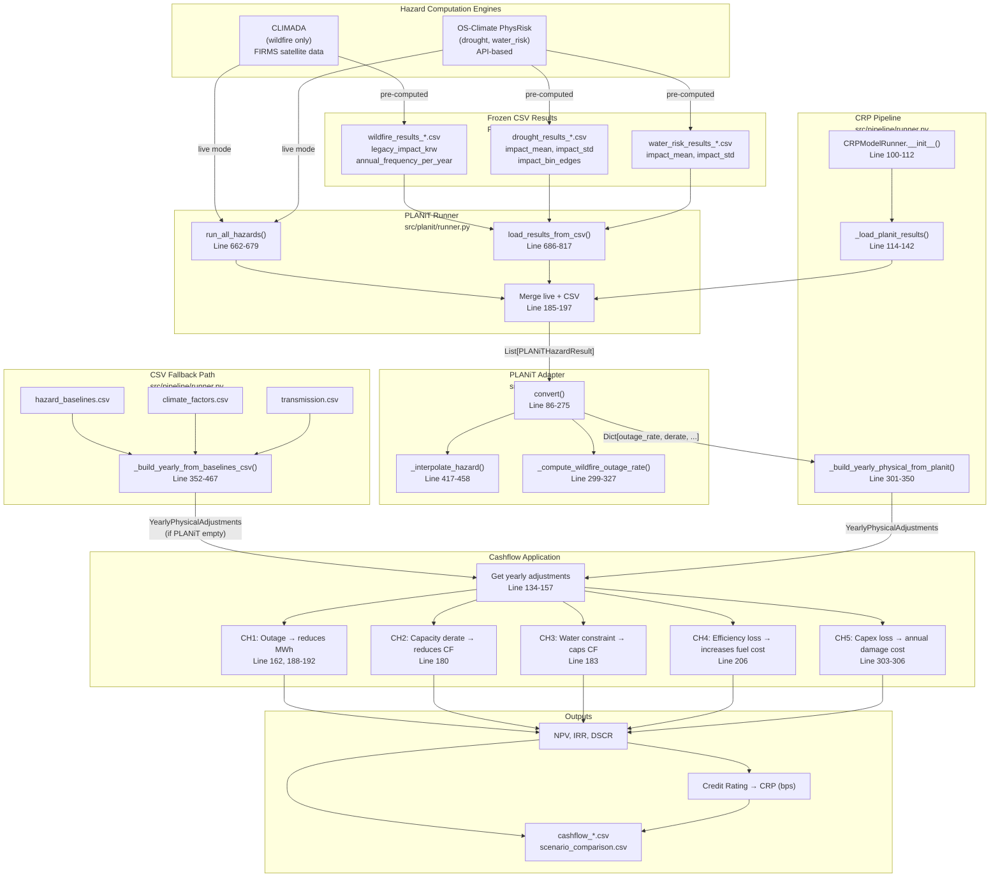

# Physical Risk Module: Data Flow, Parameter Audit, and Dead Data

> Generated: 2026-05-02 | Covers: `src/planit/`, `Physicalrisk_PLANiT/`, `src/pipeline/runner.py`, `src/financials/cashflow.py`

---

## 1. System Architecture (Mermaid)



---

## 2. Step-by-Step Execution Sequence

### Step 0: Initialization
```
CRPModelRunner.__init__(base_dir)            # src/pipeline/runner.py:105
  ├─ PLANiTIntegrationConfig()               # src/planit/config.py:10
  ├─ _load_planit_results()                  # src/pipeline/runner.py:114
  │   ├─ Check CRP_PLANIT_MODE env var       # Line 121 (default: "live")
  │   ├─ CSV path: Physicalrisk_PLANiT/data/results/
  │   └─ Returns: List[PLANiTHazardResult]
  └─ PLANiTAdapter(config)                   # src/planit/adapter.py:74
```

### Step 1: Load Hazard Data
```
PLANiTRunner.load_results_from_csv()         # src/planit/runner.py:686-817
  ├─ Scan for wildfire_results_*.csv         # Line 745 (newest file only)
  │   ├─ Read: scenario, legacy_impact_krw, annual_frequency_per_year, n_events
  │   └─ Replicate across anchor_years [2030, 2040, 2050, 2060]  ← IMPORTANT: no year dimension
  ├─ Scan for drought_results_*.csv          # Line 772
  │   ├─ Read: scenario (e.g. "ssp245_2030"), asset, impact_mean, impact_std
  │   └─ Split scenario string → scenario + year
  └─ Scan for water_risk_results_*.csv       # Same structure as drought
```

**Output**: `List[PLANiTHazardResult]` — flat list, all hazards/scenarios/years

### Step 2: Scenario Selection
```
_build_yearly_physical_from_planit()         # src/pipeline/runner.py:301-350
  ├─ Map CRP scenario → SSP + target_year:
  │     "baseline"              → (ssp126, 2024)
  │     "moderate_physical"     → (ssp245, 2040)
  │     "high_physical"         → (ssp585, 2040)
  │     "severe_drought"        → (ssp585, 2050)
  └─ For each year in [start_year, start_year + operating_years]:
        Call adapter.convert(results, year, crp_scenario)
```

### Step 3: Hazard → Adjustment Conversion
```
PLANiTAdapter.convert()                      # src/planit/adapter.py:86-275
  ├─ Group results by (hazard_type, scenario)
  ├─ WILDFIRE → outage_rate:
  │     1. Fallback order if SSP missing: ssp585 → ssp245 → ssp126 → historical
  │     2. Interpolate to target_year (linear between anchors)
  │     3. outage_rate = freq × outage_prob × (duration_h / 8760)
  │     4. outage_rate *= get_climate_factor("wildfire", year, scenario)
  ├─ DROUGHT → capacity_derate:
  │     1. Interpolate impact_mean (or distribution expected) to target_year
  │     2. capacity_derate = impact_mean × drought_severity_scale
  └─ WATER_RISK → water_constrained_capacity:
        1. Interpolate impact_mean to target_year
        2. water_constrained_capacity = max(0, 1 − impact_mean)
```

### Step 4: Fallback Path (if PLANiT results empty)
```
_build_yearly_from_baselines_csv()           # src/pipeline/runner.py:352-467
  ├─ Load hazard_baselines.csv               # data/physical/hazard_baselines.csv
  ├─ Load climate_factors.csv                # data/physical/climate_factors.csv
  ├─ Load transmission.csv                   # data/raw/transmission.csv
  └─ For each year:
        plant_outage = wf_freq × cf("wildfire") × outage_rate_formula
                     + tc.outage_rate × cf("tropical_cyclone")
        capacity_derate = drought.derate × cf("drought")
        efficiency_loss = drought.eff_loss × cf("drought")
                        + heat_stress.eff_loss × cf("heat_stress")
        line_outage = transmission_outage_rate(wf, tc, heat, line_params)
                    + substation_outage_rate(flood, line_params)
        capex_loss = Σ(damage_ratio × freq × cf) + line_annual_damage_fraction
```

### Step 5: Apply to Cashflow
```
compute_cashflows_timeseries()               # src/financials/cashflow.py:85-339
  ├─ CH1 OUTAGE:      total = 1 − (1 − plant)(1 − line)
  │                    actual_mwh = capacity_mw × 8760 × cf × (1 − outage)
  ├─ CH2 DERATE:       cf = base_cf × (1 − capacity_derate)
  ├─ CH3 WATER CAP:    cf = min(cf, water_constrained_capacity)
  ├─ CH4 EFFICIENCY:   fuel_cost = actual_mwh × heat_rate × (1 + eff_loss) × fuel_price
  └─ CH5 CAPEX LOSS:   capex = total_capex × capex_loss_rate
```

---

## 3. Parameter Table (Excel-Style)

### 3A. Wildfire Conversion Parameters

| Parameter | Value | Source | Used At | Notes |
|---|---|---|---|---|
| `annual_event_frequency_per_year` | from CSV | `wildfire_results_*.csv` | adapter.py:161 | CLIMADA output |
| `wildfire_outage_probability` | `0.10` | **HARDCODED** config.py:62 | adapter.py:189 | P(outage \| event) |
| `wildfire_outage_duration_hours` | `24.0` | **HARDCODED** config.py:63 | adapter.py:192 | Hours per outage |
| `hours_per_year` | `8760.0` | **HARDCODED** config.py:64 | vulnerability.py:112 | Physical constant |
| `climate_factor` | varies | `climate_factors.csv` | adapter.py:200 | Year × scenario multiplier |
| `i_half` | `409.5` | **HARDCODED** vulnerability.py:62 | vulnerability.py:90 | FWI at 50% damage |
| `fire_prop_probability` | `0.21` | **HARDCODED** hazard.py:97 | hazard.py:97 | Historical fire spread |
| `max_it_propa` | `500000` | **HARDCODED** hazard.py:61 | hazard.py:61 | Max propagation iterations |
| `blurr_steps` | `3` | **HARDCODED** hazard.py:62 | hazard.py:62 | Spatial blurring |
| `n_probabilistic_seasons` | `10` | **HARDCODED** hazard.py:92 | hazard.py:92 | Synthetic fire seasons |

**Formula**: `outage_rate = freq × 0.10 × (24 / 8760) × climate_factor`

### 3B. Drought Conversion Parameters

| Parameter | Value | Source | Used At | Notes |
|---|---|---|---|---|
| `impact_mean` | from CSV | `drought_results_*.csv` | adapter.py:223 | PhysRisk output (fraction) |
| `drought_severity_scale` | `1.0` | **HARDCODED** config.py:57 | adapter.py:241 | Scaling multiplier |
| `drought_use_distribution` | `True` | **HARDCODED** config.py:66 | adapter.py:233 | Use distribution expected value |

**Formula**: `capacity_derate = impact_mean × 1.0`

### 3C. Water Risk Conversion Parameters

| Parameter | Value | Source | Used At | Notes |
|---|---|---|---|---|
| `impact_mean` | from CSV | `water_risk_results_*.csv` | adapter.py:246 | PhysRisk output (fraction) |
| `water_risk_use_distribution` | `True` | **HARDCODED** config.py:67 | adapter.py:258 | Use distribution expected value |

**Formula**: `water_constrained_capacity = max(0, 1 − impact_mean)`

### 3D. Transmission Line Parameters

| Parameter | Value | Source | Used At | Notes |
|---|---|---|---|---|
| `line_wildfire_outage_probability` | `0.20` | `transmission.csv` / **HARDCODED fallback** vulnerability.py:183 | vulnerability.py:183 | Fallback if CSV key missing |
| `line_wildfire_outage_duration_hours` | `12` | `transmission.csv` / **HARDCODED fallback** vulnerability.py:184 | vulnerability.py:184 | |
| `line_typhoon_outage_probability` | `0.30` | `transmission.csv` / **HARDCODED fallback** vulnerability.py:188 | vulnerability.py:188 | |
| `line_typhoon_outage_duration_hours` | `8` | `transmission.csv` / **HARDCODED fallback** vulnerability.py:189 | vulnerability.py:189 | |
| `line_heat_sag_probability` | `0.05` | `transmission.csv` / **HARDCODED fallback** vulnerability.py:193 | vulnerability.py:193 | |
| `line_heat_sag_duration_hours` | `2` | `transmission.csv` / **HARDCODED fallback** vulnerability.py:194 | vulnerability.py:194 | |
| `substation_flood_outage_probability` | `0.40` | `transmission.csv` / **HARDCODED fallback** vulnerability.py:207 | vulnerability.py:207 | |
| `substation_flood_outage_duration_hours` | `72` | `transmission.csv` / **HARDCODED fallback** vulnerability.py:208 | vulnerability.py:208 | |
| `line_annual_damage_fraction` | `0.001` | `transmission.csv` | runner.py:446 | Annual asset loss |

### 3E. Exposure Valuation Parameters (Physicalrisk_PLANiT)

| Parameter | Value | Source | Used At | Notes |
|---|---|---|---|---|
| `power_plant_value_per_mw_krw` | `232,000,000` | `unified_config.yaml defaults` / **HARDCODED fallback** exposure.py:139 | exposure.py:139 | KRW per MW |
| `transmission_line_value_per_km_krw` | `23,000,000,000` | `unified_config.yaml defaults` / **HARDCODED fallback** exposure.py:144 | exposure.py:144 | KRW per km |
| `substation_value_per_mva_krw` | `4,500,000` | `unified_config.yaml defaults` / **HARDCODED fallback** exposure.py:151 | exposure.py:151 | KRW per MVA |
| `substation_kv_to_mva_factor` | `1.5` | **HARDCODED** exposure.py:152 | exposure.py:152 | |
| `substation_default_mva` | `1000` | `unified_config.yaml defaults` / **HARDCODED fallback** exposure.py:152 | exposure.py:152 | |

### 3F. PLANiT Runner Defaults (Dynamic Location Mode)

| Parameter | Value | Source | Used At | Notes |
|---|---|---|---|---|
| `default_capacity_mw` | `2100` | **HARDCODED** runner.py:344 | runner.py:344 | For dynamic location |
| `site_half_size_deg` | `0.01` | **HARDCODED** runner.py:345 | runner.py:345 | ~1.1 km radius |
| `default_substation_voltage_kv` | `345` | **HARDCODED** runner.py:373 | runner.py:373 | |
| `default_substation_distance_km` | `30` | **HARDCODED** runner.py:391 | runner.py:391 | |
| `default_substation_bearing_deg` | `235` | **HARDCODED** runner.py:392 | runner.py:392 | |

### 3G. Pipeline Runner Fallback Duplicates

| Parameter | Value | Source | Used At | Notes |
|---|---|---|---|---|
| `plant_wf_p` | `0.10` | **HARDCODED** runner.py:394 | runner.py:394 | Duplicates config.py:62 |
| `plant_wf_dur` | `24.0` | **HARDCODED** runner.py:395 | runner.py:395 | Duplicates config.py:63 |

---

## 4. Cashflow Impact Table (Excel-Style Worked Example)

This shows how a single year's physical adjustments flow through to financial metrics.

**Assumptions**: `capacity_mw=2100`, `base_cf=0.85`, `heat_rate=9.5`, `price=80 KRW/kWh`, `fuel_price=3.5 KRW/kWh-thermal`

| Step | Variable | Formula | Baseline | high_physical |
|---|---|---|---|---|
| A | `plant_outage_rate` | from PLANiT wildfire | 0.0 | 0.000266 |
| B | `transmission_outage_rate` | from baselines × climate_factor | 0.0 | 0.000042 |
| C | `total_outage_rate` | `1 − (1−A)(1−B)` | 0.0 | 0.000308 |
| D | `capacity_derate` | from PLANiT drought | 0.0 | 0.0051 |
| E | `water_constrained_capacity` | `max(0, 1 − water_risk_impact)` | 1.0 | 1.0 |
| F | `efficiency_loss` | drought_eff + heat_eff | 0.0 | 0.00307 |
| G | `base_cf` | from transition scenario | 0.85 | 0.85 |
| H | `adjusted_cf` | `min(G × (1−D), E)` | 0.85 | 0.8457 |
| I | `potential_mwh` | `2100 × 8760 × H` | 15,548,400 | 15,469,699 |
| J | `actual_mwh` | `I × (1−C)` | 15,548,400 | 15,464,935 |
| K | `revenue` | `J × 80` | 1,243,872,000 | 1,237,194,800 |
| L | `effective_heat_rate` | `9.5 × (1 + F)` | 9.5 | 9.5292 |
| M | `fuel_cost` | `J × L × 3.5` | 517,234,200 | 515,836,585 |
| N | `revenue_loss_from_physical` | `K_baseline − K_scenario` | 0 | 6,677,200 |

---

## 5. Data Source Inventory: Alive vs Dead

### 5A. ALIVE — Actively loaded and used

| File | Loaded By | Purpose |
|---|---|---|
| `Physicalrisk_PLANiT/data/results/wildfire_results_*.csv` | `PLANiTRunner.load_results_from_csv()` | CLIMADA wildfire frequency + impact |
| `Physicalrisk_PLANiT/data/results/drought_results_*.csv` | `PLANiTRunner.load_results_from_csv()` | PhysRisk drought impact_mean |
| `Physicalrisk_PLANiT/data/results/water_risk_results_*.csv` | `PLANiTRunner.load_results_from_csv()` | PhysRisk water risk impact_mean |
| `data/physical/hazard_baselines.csv` | `load_hazard_baselines()` via `runner.py:365` | Fallback hazard frequencies |
| `data/physical/climate_factors.csv` | `get_climate_factor()` via `adapter.py:200` | Scenario × year multipliers |
| `data/raw/transmission.csv` | `load_inputs()` via `data_loader.py` | Transmission line parameters |
| `Physicalrisk_PLANiT/config/unified_config.yaml` | `PLANiTRunner` (live mode) | CLIMADA + PhysRisk config |
| `Physicalrisk_PLANiT/data/samcheok_power_grid_all.geojson` | `load_assets_from_geojson()` | Asset locations + geometry |
| `Physicalrisk_PLANiT/data/fire_archive_M-C61_701491.csv` | CLIMADA `WildFire.from_hist_fire_seasons_FIRMS()` | NASA FIRMS satellite data |

### 5B. DEAD — CSV files with loaders defined but NEVER CALLED

| File | Loader Function | Status |
|---|---|---|
| `data/physical/compound_events.csv` | `load_compound_events()` in loaders.py | **DEAD** — function exists, never imported |
| `data/physical/damage_function_params.csv` | `load_damage_function_params()` in loaders.py | **DEAD** — function exists, never imported |
| `data/physical/plant_exposure.csv` | `load_plant_exposures()` in loaders.py | **DEAD** — function exists, never imported |
| `data/physical/temperature_projections.csv` | `load_temperature_projections()` in loaders.py | **DEAD** — function exists, never imported |
| `data/physical/flood_risk_notes.csv` | `load_flood_risk_notes()` in loaders.py | **DEAD** — function exists, never imported |
| `data/physical/data_sources.csv` | `load_data_sources()` in loaders.py | **DEAD** — function exists, never imported |

### 5C. DEAD — CSV files superseded by newer versions

| File | Superseded By | Status |
|---|---|---|
| `data/raw/plant.csv` | `data/raw/plant_parameters.csv` | **SUPERSEDED** — never referenced |
| `data/raw/defaults.csv` | Values integrated into loaders directly | **SUPERSEDED** — never referenced |
| `data/raw/financing.csv` | `data/raw/financing_params.csv` | **SUPERSEDED** — never referenced |
| `data/raw/physical.csv` | PLANiT results + hazard_baselines.csv | **LEGACY** — pre-PLANiT data |
| `data/raw/physical_scenarios.csv` | PLANiT + PHYSICAL_SCENARIO_SSP_MAP | **LEGACY** — pre-PLANiT data |

### 5D. DEAD — Output files written but never read back

| File Pattern | Written By | Status |
|---|---|---|
| `data/physical_risk_steps/output/physical_adj_pathA_*.csv` (14 files) | `_save_physical_adjustments()` runner.py:482 | **WRITE-ONLY** — diagnostic output, never consumed |
| `data/physical_risk_steps/output/physical_adj_pathB_*.csv` (14 files) | `_save_physical_adjustments()` runner.py:496 | **WRITE-ONLY** — diagnostic output, never consumed |

### 5E. DEAD — Documentation-only CSVs (never loaded by code)

| File | Purpose | Status |
|---|---|---|
| `data/physical_risk_steps/input/climada_data.csv` | CLIMADA query documentation | **DOCUMENTATION** — never loaded |
| `data/physical_risk_steps/input/literature_data.csv` | Literature parameters record | **DOCUMENTATION** — never loaded |
| `data/physical_risk_steps/input/model_assumptions.csv` | Model assumptions record | **DOCUMENTATION** — never loaded |

### 5F. DEAD — Unused config entries in `unified_config.yaml`

| Config Key | Purpose | Status |
|---|---|---|
| `climada.exposure.litpop` | LitPop-based exposure | **DEAD** — asset-based exposure used instead |
| `output.plots` | Plot type list | **DEAD** — never read by code |
| `output.comparison_report` | Report generation flag | **DEAD** — never read by code |

### 5G. DEAD — Unused loader functions in `src/data/loaders.py`

11 of 13 functions never called:
`load_compound_events`, `load_damage_function_params`, `load_plant_exposures`,
`load_temperature_projections`, `load_flood_risk_notes`, `load_data_sources`,
`load_korean_coal_fleet`, `load_ngfs_scenarios`, `load_generation_loss_factors`,
`load_credit_spreads`, `load_historical_events`

**Only 2 actively called**: `get_climate_factor()`, `load_hazard_baselines()`

---

## 6. Hardcoded Values Inventory (Complete)

### 6A. CRITICAL — Values buried in function code, not from config/CSV

| # | File | Line | Value | Parameter | Risk |
|---|---|---|---|---|---|
| 1 | `src/planit/vulnerability.py` | 62 | `409.5` | WildfireVulnerability.i_half | Damage function calibration |
| 2 | `src/planit/vulnerability.py` | 109 | `0.10` | wildfire outage_probability default | Duplicates config.py |
| 3 | `src/planit/vulnerability.py` | 111 | `24.0` | wildfire outage_duration_hours default | Duplicates config.py |
| 4 | `src/planit/vulnerability.py` | 183 | `0.20` | line_wildfire_outage_probability fallback | Silent fallback if CSV key typo |
| 5 | `src/planit/vulnerability.py` | 184 | `12` | line_wildfire_outage_duration_hours fallback | Silent fallback |
| 6 | `src/planit/vulnerability.py` | 188 | `0.30` | line_typhoon_outage_probability fallback | Silent fallback |
| 7 | `src/planit/vulnerability.py` | 189 | `8` | line_typhoon_outage_duration_hours fallback | Silent fallback |
| 8 | `src/planit/vulnerability.py` | 193 | `0.05` | line_heat_sag_probability fallback | Silent fallback |
| 9 | `src/planit/vulnerability.py` | 194 | `2` | line_heat_sag_duration_hours fallback | Silent fallback |
| 10 | `src/planit/vulnerability.py` | 207 | `0.40` | substation_flood_outage_probability fallback | Silent fallback |
| 11 | `src/planit/vulnerability.py` | 208 | `72` | substation_flood_outage_duration_hours fallback | Silent fallback |
| 12 | `src/pipeline/runner.py` | 394 | `0.10` | plant_wf_p | Duplicates config.py:62 |
| 13 | `src/pipeline/runner.py` | 395 | `24.0` | plant_wf_dur | Duplicates config.py:63 |
| 14 | `PLANiT/src/core/exposure.py` | 139 | `232000000` | power_plant_value_per_mw_krw fallback | Asset valuation |
| 15 | `PLANiT/src/core/exposure.py` | 144 | `23000000000` | transmission_line_value_per_km_krw fallback | Asset valuation |
| 16 | `PLANiT/src/core/exposure.py` | 151 | `4500000` | substation_value_per_mva_krw fallback | Asset valuation |
| 17 | `PLANiT/src/core/exposure.py` | 152 | `1.5` | kV → MVA conversion factor | No config source |
| 18 | `PLANiT/src/core/exposure.py` | 152 | `1000` | substation_default_mva fallback | Asset valuation |
| 19 | `PLANiT/src/core/vulnerability.py` | 17 | `409.5` | CLIMADA ImpfWildfire i_half | Duplicate of #1 |
| 20 | `PLANiT/src/core/hazard.py` | 61 | `500000` | max_it_propa (fire propagation) | CLIMADA simulation param |
| 21 | `PLANiT/src/core/hazard.py` | 62 | `3` | blurr_steps (spatial blur) | CLIMADA simulation param |
| 22 | `PLANiT/src/core/hazard.py` | 92 | `10` | n_probabilistic_seasons | CLIMADA simulation param |
| 23 | `PLANiT/src/core/hazard.py` | 97 | `0.21` | fire_prop_probability default | Overridden by config but default used |
| 24 | `PLANiT/src/main.py` | 50 | `120` | litpop res_arcsec | LitPop resolution |
| 25 | `PLANiT/src/main.py` | 301 | `2020` | litpop reference_year | LitPop reference |
| 26 | `PLANiT/src/main.py` | 302 | `2240e12` | total_value_krw (South Korea GDP proxy) | National exposure |
| 27 | `src/planit/runner.py` | 344 | `2100` | default capacity_mw (dynamic location) | Dynamic mode param |
| 28 | `src/planit/runner.py` | 345 | `0.01` | site_half_size_deg | Dynamic mode param |
| 29 | `src/planit/runner.py` | 373 | `345` | default substation voltage (kV) | Dynamic mode param |
| 30 | `src/planit/runner.py` | 391 | `30` | default substation distance (km) | Dynamic mode param |
| 31 | `src/planit/runner.py` | 392 | `235` | default substation bearing (deg) | Dynamic mode param |

### 6B. MODERATE — Defaults in config dataclass (single source but could be in CSV)

| # | File | Line | Value | Parameter |
|---|---|---|---|---|
| 32 | `src/planit/config.py` | 54 | `[2030,2040,2050,2060]` | anchor_years (also in runner.py:707) |
| 33 | `src/planit/config.py` | 57 | `1.0` | drought_severity_scale |
| 34 | `src/planit/config.py` | 58 | `1.0` | heat_efficiency_scale |
| 35 | `src/planit/config.py` | 59 | `1.0` | flood_outage_scale |
| 36 | `src/planit/config.py` | 62 | `0.10` | wildfire_outage_probability |
| 37 | `src/planit/config.py` | 63 | `24.0` | wildfire_outage_duration_hours |
| 38 | `src/planit/config.py` | 65 | `20.0` | wildfire_frequency_reference_years |
| 39 | `src/pipeline/runner.py` | 46 | `2024` | baseline year in PHYSICAL_SCENARIO_SSP_MAP |

### 6C. ACCEPTABLE — Physical/mathematical constants (OK to keep)

| File | Value | What It Is |
|---|---|---|
| `exposure.py:13` | `111.0` | DEG_TO_KM geographic constant |
| `exposure.py:27` | `6371` | Earth radius (km) |
| `config.py:64` | `8760.0` | Hours per year |
| `cashflow.py:188` | `8760` | Hours per year |

---

## 7. Interpolation Logic

```
Year range:  2024  ...  2030  ...  2040  ...  2050  ...  2060  ...  2064
             |←─ blend ─→|← linear →|← linear →|← linear →|← hold →|

Before 2030:  Linear blend from baseline_value (2024) to first anchor (2030)
2030-2060:    Linear interpolation between anchor values
After 2060:   Hold last anchor value constant
```

**Code**: `PLANiTAdapter._interpolate_hazard()` at `src/planit/adapter.py:417-458`

---

## 8. Key Observations

1. **CLIMADA wildfire has no year dimension** — results are replicated across all anchor years. Climate progression comes only from `climate_factors.csv` multipliers applied externally.

2. **Fallback values in vulnerability.py are dangerous** — `line_params.get("key", HARDCODED_DEFAULT)` silently uses the hardcoded value if the CSV column name doesn't match exactly. No warning is logged.

3. **`efficiency_loss` is always 0.0 from the adapter** — it's only populated via the CSV fallback path (`_build_yearly_from_baselines_csv`). The PLANiT path never computes it.

4. **11 of 13 loader functions are dead code** — significant maintenance burden for no benefit.

5. **28 output CSVs written but never consumed** — pathA/pathB files are diagnostic-only.
